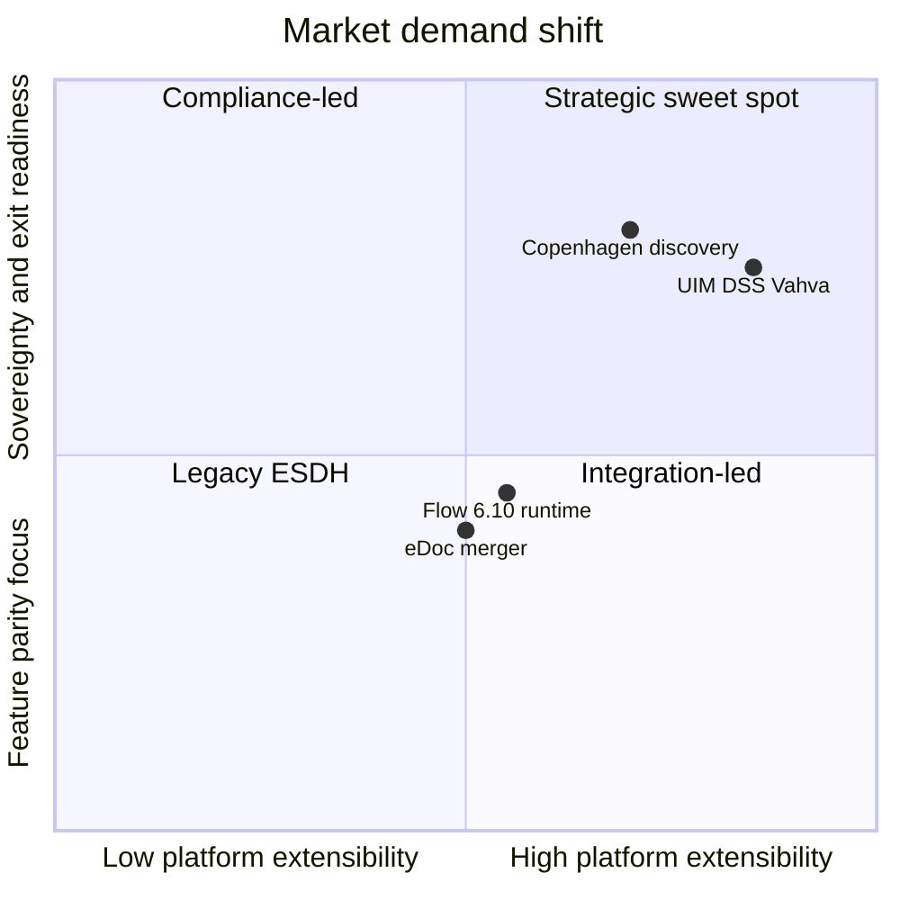
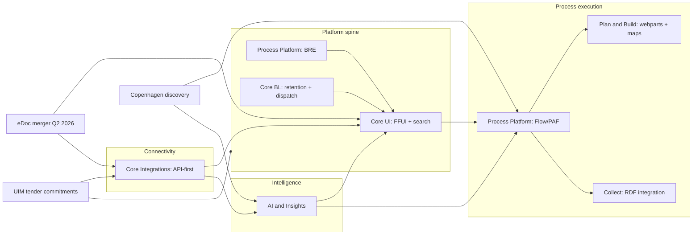

# Product team objectives — strategy brief (draft)

**Purpose:** Anchor the upcoming team objective refresh. This brief outlines the main opportunities and challenges facing Public 360° product development, so proposed team objectives and workshop discussions start from a shared strategic picture—not from the current ProductPlan backlog.

**Status:** Draft for QCLT review  
**Author:** Morten Jensen (with agent assist)  
**Date:** 10 September 2026  
**Next step:** Propose 2–3 team objectives per product team + dependency map → team workshops (negotiation phase)

**Process context:** [Product Governance](https://wiki.software-innovation.com/wiki/Product_Governance) — company objectives → product team objectives → team-proposed KRs → negotiation → roadmap in ProductPlan.

---

## Executive summary

Public 360° is at an inflection point. We have **proven new platform capabilities** (Flow/PAF runtime, RDF, Online migrations) while simultaneously facing **large tender and discovery portfolios** (UIM, Copenhagen, DSS overlap) that expose gaps in configurability, search, process usability, and AI readiness.

The central strategic tension is **capacity vs. credibility**:

- **Credibility** requires us to deliver on eDoc merger, Nordic Online growth, and reference customers (NVE, Oslo, NAV accessibility).
- **Capacity** is consumed by legacy maintenance (IFAR, customized deployments) and parallel bid portfolios that largely demand the same product investments—especially **FFUI, platform spine, search, integrations, and BRE**.

**Strategic implication:** We cannot treat UIM, Copenhagen discovery, eDoc merger, and Flow operationalization as independent threads. They converge on a small number of platform bets. Objectives must name those bets explicitly and defer or decline the rest.

---

## Strategic context

### Where we are

| Dimension                       | State                                                                                                                                                                         |
| ------------------------------- | ----------------------------------------------------------------------------------------------------------------------------------------------------------------------------- |
| **Flow / PAF**                  | 6.10 runtime operational (ProcessView, milestones, stages, progress plans). NVE is the reference customer. Risk has shifted from feasibility to **capacity and UX maturity**. |
| **Nordic 360° Online**          | Active migration and growth program; company KR targets 50 RDF customers (currently 6).                                                                                       |
| **eDoc merger**                 | Company objective: succeed by Q2 2026. Touches Transparency, Core UI, Core Integrations, Decision Support, Plan & Build.                                                      |
| **ProductPlan objectives**      | 44 active objectives; many KRs at 0% progress or placeholder text. Objective set has grown faster than KR discipline.                                                         |
| **Tender / discovery pressure** | UIM (27 commitment Features, 45–75 person-months), Copenhagen (AST, KK, NB), DSS (54 preliminary Features, ~48% overlap with UIM).                                            |

### Operational patterns (discovery + delivery)

Two patterns repeat across UIM tender analysis, Copenhagen discovery, and reference-customer delivery:

1. **Manual checking and clicking, not deciding** — case handlers spend time on QA, metadata, registration, and navigation rather than judgment work.
2. **The next sale is maturity on the foundation** — customers accept that execution works (AST on PE; NVE on Flow runtime) but expect **integrated stories**: execution + visualization + portfolio + intelligence, with auditability and accessibility built in.

---

## Market trends and demands

This section anchors team objectives in **what the market is asking for**, not only what individual tenders list row-by-row.

| Source type | Coverage |
|-------------|----------|
| **Tender material** | UIM, KK, VN Asia (Vahva), KUM-SLKS, HSØ, Nationalbanken — formal minimum requirements |
| **Copenhagen discovery (Jun 2026)** | AST, KK, Nationalbanken — qualitative constraints and use cases |
| **GoforIT conference (Sep 2026, Oslo)** | Norwegian public sector — sovereignty, agents, ecosystem positioning ([Sebastian Reichmann notes](#sources)) |

Together these show a consistent direction: buyers want **sovereign, extensible platforms** that support **governed AI and customer-owned agents** — not a closed product with bolt-on features.

### Foundation — non-negotiable constraints (Danish public sector)

From Copenhagen discovery (AST, KK, Nationalbanken) — treat these as baseline market demands, not optional nice-to-haves:

| Constraint | What it means in practice | Discovery signal |
|------------|---------------------------|------------------|
| **Domestic-cloud AI** | AI processing and LLM routing must stay within approved national/cloud boundaries | NB: data must not leave Denmark; preference for local/private Copilot. AST: #1 ask is AI on domestic cloud |
| **Accuracy and auditability** | Automation must be traceable; wrong legal references or metadata are costlier than no automation | AST: ~30 min QA per case at scale. KK: AI outputs sometimes cite wrong legal paragraphs |
| **Accessibility (WCAG)** | Universal design is a bid and go-live gate, not a retrofit | NAV objective in ProductPlan; HSØ bid cites WCAG 2.1 AA |
| **Centralized AI governance** | Customers want monitored, routed AI usage — not shadow integrations | KK: all LLM interactions through a central platform with usage visibility |
| **Change management** | Process and regulation change mid-case; systems must support controlled adaptation | AST: regulatory changes pause cases and ripple through templates, metadata, and rules |

These constraints apply **even when we do not bid** a specific tender — they define how Danish (and increasingly **Nordic**) public buyers evaluate credibility. GoforIT (Sep 2026) confirms the same themes in Norway: digital and AI sovereignty as strategic priority, not only Danish procurement language.

### Trend 1 — Digital sovereignty and operational control

Public buyers expect to **control data, configuration, and deployment** without perpetual vendor intervention. This goes beyond GDPR compliance into **who can change what, where data lives, and how exit works**.

**How customers frame it — "handlingsrom" (room for action)**

Oslo municipality (GoforIT) is mapping technology dependencies without a fixed change strategy yet — similar to NAV. The priority is **agnostic architectures** that preserve optionality to swap components later. Sovereignty is **not** necessarily rejecting US or hyperscale providers outright; it is balancing:

- **Short term:** efficiency and access to best available technology (including Copilot and US productivity tools already adopted org-wide — hard to revert)
- **Long term:** resilience, flexibility, and control (EU/Nordic-hosted infra for central tasks; IT/AI competence centres that could drive a shift)

**Telenor** is positioning **Nordic data infrastructure** as part of this response — a signal that sovereignty is becoming an **infra + architecture** purchase, not only a legal clause.

**Customer segmentation matters**

| Segment | Sovereignty posture | Implication for 360 |
|---------|---------------------|---------------------|
| **Large (Oslo, NAV, state)** | Mapping dependencies; agnostic component strategy; building AI/IT competence centres | Platform APIs, portability, modular architecture — they can eventually change if we enable it |
| **Small/mid municipalities** | Fast AI adoption on standard cloud (mostly Microsoft); limited IT muscle to swap for OSS or less rich platforms | Need **simple, governed defaults** and integration hooks — cannot assume they will self-build sovereign stack |
| **Collaboratives (NKF, 66 kommuner)** | Large-scale Copilot/agent programmes; low productization today; archive integration still missing | **Leap/support** opportunity — connect their agents to 360/PnB rather than compete head-on |

**Tender evidence:**

| Source | Requirement / signal |
|--------|---------------------|
| **UIM MK-7** | Customer configures deletion policies **without vendor involvement** |
| **UIM (evaluation)** | Positive weight on admin extending data model, metadata, UI, and API **without code changes, database changes, or vendor-specific development** |
| **VN Asia (Vahva)** | TLIV confidentiality, Katakri audit, EU/NATO case segregation; **domestic cloud options**; on-prem OpenShift container path |
| **VN Asia Liite 2.5** | GDPR 25 embedded/privacy-by-design; role- and document-based least privilege |
| **Nationalbanken** | Strict data classification; AI must not leave Denmark; regulated exit process (Bilag 7 exit plan) |
| **KK gate brief** | Strict GDPR/AI governance surface; Koncern IT risk review up to 3 months |

| **KK gate brief** | Strict GDPR/AI governance surface; Koncern IT risk review up to 3 months |
| **GoforIT / Oslo** | Dependency mapping; flexibility in future technology choices; concern about US provider concentration |

**Product implication:** Objectives must cover **admin-self-service configuration**, **documented data models**, **deployment flexibility** (cloud/on-prem/containers/Nordic hosting options), and **security/compliance as product capabilities** — not project services. We need a **clear sovereignty value message** for AI and analytics offerings specifically (Sebastian: general platform partly there; AI layer not yet).

### Trend 2 — AI as a governed capability track, not a feature list

The market question is shifting from *"How can we use AI?"* to *"How should our processes, platforms, and supplier relationships change in an AI-first environment?"* (GoforIT overall takeaway).

AI demand is uniform; **permissible AI** is not. The market separates:

- **Assistive intelligence** — classification, summaries, redaction, metadata suggestions, translation (AST, KK, NB discovery)
- **Governed execution** — domestic cloud, central LLM routing, audit trails, human-in-the-loop (KK, NB)
- **Composable AI** — REST integration to customer-owned AI (KK option **435503** AI Assist; KK conflict search via external AI/GIS)
- **Customer-built agents** — municipalities building agents on standard cloud (Microsoft-heavy) that must **operate on or alongside** 360/PnB (Sandnes, Nesodden, NKF)

Tenders ask for **roadmaps and honesty** (KK B2-16 / 5.2.19.1: existing vs planned AI, standard vs add-on) — not generic "AI-ready" claims.

**Agents — the new competitive frame**

Norwegian municipalities are moving from experimentation to **operational agents embedded in case-management processes**, especially Plan & Build:

| Signal | Detail |
|--------|--------|
| **Stavanger** | Leading digital municipality 2026; internal dev teams; agent projects |
| **Sandnes** | 3-person AI team; agents for case handling; **integration with 360 PnB** explicitly desired |
| **Nesodden** | AI-supported case assistant for byggesak; rolling out to more domains; citizen assistant; NAV-related work |
| **NKF × Microsoft** | 66 municipalities, 135 people — Copilot-based assistants for PnB; Word side panel (summary, guidance); **no archive integration yet** — Møre og Romsdal wants to build this |
| **Visma / Framtind** | Agents as workforce answer (600k inhabitants by 2050, demographic pressure); **"bring your own AI"** via APIs; AI-first internal dev (claimed 5× productivity) — **mostly claims, weak product evidence so far** |

**Strategic fork for 360 (requires decision D7):**

| Path | Description | When it fits |
|------|-------------|--------------|
| **A — Native agents** | 360 owns case-management agents (Mimir, domain agents on PnB/Flow) | Where we have domain depth and customer prefers vendor-delivered capability |
| **B — AI-enabled platform** | 360 exposes **agent-ready APIs**, permissions, context, events — customers and partners bring models/agents | Sandnes, NKF, KK 435503, Visma-competitive positioning |
| **C — Leap / support** | Fund integration partnerships (e.g. NKF → archive; GAIIA collaboration) without owning full agent stack | Large collaboratives; low productization today |

Sebastian's recommendation: **mix of B + C** — do not assume we outcompete every municipal agent initiative; **qualify standard complementary components** and support customer-driven innovation through integrations.

**Workforce and process transformation**

Visma frames agents as absorbing administrative load so humans can focus on physical/judgment work (healthcare, defence, construction). The stronger opportunity is **process redesign with human oversight**, not isolated copilots — but that requires domain partnerships and funded collaboration, not only feature teams.

Public sector is also discussing **AI-first IT production** (Skatteetaten NO ~700 devs, Skatteverket SE ~1400) — pressure that will eventually flow into **how they expect vendors to develop and integrate**, not only how they use AI in case handling.

**Tender + conference evidence:**

| Source | Requirement / signal |
|--------|---------------------|
| **Copenhagen AST** | AI on domestic cloud; case summaries, similar cases, archiving assistance |
| **Copenhagen KK** | Classification, summaries, redaction; centralized AI governance platform |
| **Copenhagen NB** | Early stage: translation, knowledge management; strict security constraints |
| **KK PFR 435503** | REST integration to municipality AI Assist for building-case screening |
| **FI API brief** | Dedicated API layer/endpoints for **AI agents** with segregated access controls |
| **UIM / company OKR** | "Accelerating AI adoption" proposed in ProductPlan — still immature KRs |
| **GoforIT** | Sovereignty + agents as top themes; municipal agent builds on 360 PnB; NKF scale collaboration |
| **Visma / Framtind** | Competitor narrative: agent portfolio + BYO-AI APIs (unproven in product) |

**Product implication:** AI objectives should define:

1. **Governed AI infrastructure** — model/hosting choice, domestic-cloud path, central routing (aligns with KK/NB/Copenhagen)
2. **Agent platform capabilities** — APIs, context access, permissions, events (aligns with FI brief, Sandnes, NKF gap)
3. **2–3 native reference agents** — metadata, summarization, redaction — where we own domain value (aligns with AST, Copenhagen)
4. **Partnership / leap lane** — resourced collaborations (NKF archive integration, GAIIA) — not ad hoc project work

Do **not** set KRs like "5 AI features by EOY" without sovereignty and agent-platform path (current ProductPlan gap).

**Citizen-side pressure (PnB):** Municipalities expect **more text-heavy citizen input** (including AI-assisted applications and protests) — increasing coordination load on case handlers. Agents that assist intake, classification, and triage on **our** platform become operational necessities, not innovation demos.

### Trend 3 — From product functionality to platform capabilities

Buyers increasingly procure **extensibility** — the ability to adapt the system within guardrails — rather than a fixed feature matrix implemented only by the vendor.

The shift shows up as:

| Old framing | New framing (market) |
|-------------|----------------------|
| Module does X | Customer/admin configures X without vendor code |
| UI customization project | FFUI, RDF, customer-created entities |
| Point integrations | API-first: **everything doable in UI must be doable via API** (FI API brief) |
| Vendor implements rules | Business rules engine; admin-configurable validations (UIM EK-5, KK B2-03 BRE write-back) |
| Single product UI | Loosely coupled: independent UI components, iPaaS, event-driven architecture (FI API brief; VN Asia A12 open documented interfaces) |
| Vendor-owned AI only | **Open foundation for customer/third-party agents** (Visma BYO-AI; Sandnes/NKF on 360 PnB; FI API agent endpoints) |

**Tender evidence (strongest on platform spine):**

| Source | Requirement / signal |
|--------|---------------------|
| **UIM 433895 cluster** | Customer-created entities — platform program, not a module |
| **KUM-SLKS Bilag 3** | Customer-specific objects **identical to standard objects**; admin creates/configures **without vendor**; Full Flex UI |
| **UIM EK-3 / MK-66+** | All list views configurable with first-level metadata (**435606**) |
| **VN Asia A12 (Pakollinen)** | Open, standard, documented interfaces enabling **two-way integration** |
| **FI #437273 / API brief** | REST/JSON API-first; webhooks; async jobs; Elasticsearch; SIEM-ready audit — **program-scale**, not a connector |
| **HSØ** | Full case handling via APIs from outside the system; Power Automate + SIF today; pressure for modern API surface |
| **KK #434005** | P&B as P360 module on **360 Flow** — product merge as platform play |

**Product implication:** The company KR "80% customized customer needs fit standard" is really a **platform-capability KR**. FFUI, API-first integrations, BRE, and config import/export are one strategic thread — UIM, DSS, Vahva, and KK portfolios are different expressions of the same demand.

### Trend 4 — Avoiding vendor lock-in

We can derive this confidently from tenders: buyers structure requirements so they retain **exit optionality**, **data portability**, and **integration independence**. This is not anti-vendor sentiment — it is **procurement hygiene** in multi-decade ESDH contracts.

**Tender evidence:**

| Source | Requirement / signal |
|--------|---------------------|
| **UIM MK-136 (Mindstekrav)** | Data must be accessed/extracted **without vendor-specific tools** so future migration to another platform is feasible **without data loss** — flagged internally as needing product clarification |
| **UIM MK-160** | Analytics export via **open architecture**, **documented non-proprietary interfaces** — no dependence on vendor tools, closed formats, or proprietary integration components |
| **UIM MK-171–173** | Migration documentation: data model, definitions, metadata, validation rules, mapping workshops, trial migrations |
| **Nationalbanken Bilag 7** | Formal **exit plan** — data extraction and delivery process (contract option) |
| **VN Asia PoC** | Explicit **import and export capabilities** in PoC phase |
| **VN Asia Liite 2.2** | Standard-compliant transfer file for records management plans (e.g. XML export for migration) |
| **FI API brief** | Extension via RDF/containers/integrations **without modifying core product**; loosely coupled architecture |
| **KK B2-18** | Integration landscape — customer architecture governance; deep links and register integrations as first-class |

**Product implication:** Lock-in reduction is a **product architecture objective**, not a legal appendix. It requires: documented APIs, standard export formats (Noark/XML where relevant), config portability (UIM **433887**), analytics/event streams (MK-160, SIEM — KK **435501**), and honest migration tooling narrative.

### Cross-trend summary — what buyers are really purchasing

**Strategic sweet spot:** Platform capabilities (FFUI, API-first, BRE, RDF) delivered with **sovereignty, auditability, and exit-ready data access** — plus **governed AI and agent-ready interfaces** on top, not instead. 360 wins as **secure, open foundation for AI-driven case management**, not as the only AI stack the customer may use.

### Ecosystem positioning (GoforIT)

Public customers innovate at **diverse speeds** — 360 cannot match every municipal agent experiment. Recommended strategic stance (aligned with Head of AI input):

1. **Deliver key platform innovation ourselves** — FFUI, Flow maturity, API-first, governed AI infra, native agents where domain-strong (PnB, archiving, IFAR redaction)
2. **Support customer-driven innovation** — integrations, agent context APIs, NKF-style collaboratives, GAIIA partnership lane
3. **Engage NKF / Kommunalteknisk arenas** — sovereignty and agent integration are being shaped there now

Visma's BYO-AI narrative is a **competitive warning**, not yet proven product — our window is to **ship agent platform credibly** while they remain in claims mode.

### Implications for the objective refresh

| Market trend | Primary team owners | Must appear in company/team objectives? |
|--------------|--------------------|------------------------------------------|
| Digital sovereignty | Core BL, Tech Platform, AI & Insights | Yes — deployment, logging, data residency, **sovereignty value message for AI** |
| Governed AI + agent platform | AI & Insights, Core Integrations, Core BL | Yes — rewrite proposed company AI objective; **agent APIs/events (D7)** |
| Native vs partner agents | AI & Insights, Plan & Build, Process Platform | Yes — 2–3 native agents + partnership lane (NKF, GAIIA) |
| Platform capabilities | Core UI, Core Integrations, Process Platform | Yes — likely **the** company-level bet (D1) |
| Lock-in avoidance | Core Integrations, Core BL, Tech Platform | Yes — as KRs on API, export, documentation |
| Operational UX maturity | Process Platform, Core UI, Plan & Build | Yes — desirability + Copenhagen/NVE + municipal agent UX |

---

## Main opportunities

Opportunities are ordered by strategic leverage—the degree to which investment here unlocks multiple customers, tenders, and teams.

### O1 — Platform spine and Full Flex UI (FFUI)

**What:** Customer-created entities, configurable list views, advanced search, mass update, configuration import/export, rules/validations on custom entities.

**Why it matters:**

- **UIM:** ~70–80% of portfolio risk and effort sits in platform spine + Search/FFUI clusters (Core UI: 12 Features, 8 XL).
- **DSS:** ~48% of PFRs overlap UIM in the same five clusters.
- **Copenhagen (KK):** Metadata at scale, search, reduced customization burden.
- **Company KRs:** "80% customized customer needs fit standard" (currently 30%) depends on this.

**Primary owner:** Core UI  
**Enablers:** Process Platform (BRE), Core BL (retention/dispatch), Tech Platform (logs)

### O2 — Process execution maturity (Flow / PAF + usable PE)

**What:** Production-grade Flow runtime through 6.11 GA; web-based process modelling; business-user-accessible workflow; process documentation as single source of truth.

**Why it matters:**

- **NVE:** Maps and portfolio webparts are go-live requirements; customers expect one integrated desk-to-case story.
- **Copenhagen (AST):** Strong PE satisfaction—automation that works is a proven differentiator.
- **Copenhagen (KK):** PE perceived as too hard; business users cannot maintain workflows independently.
- **Copenhagen (NB):** Publication and approval workflows—a beachhead for controlled, simple process patterns.
- **UIM / eDoc:** Workflow history, visual process steps, case templates.

**Primary owner:** Process Platform  
**Enablers:** Core UI (desktops/webparts), AI & Insights (summaries, metadata), Collect & Engage (RDF/adaption layer)

### O3 — Intelligence on the foundation (AI + metadata + search + agents)

**What:** Governed AI infrastructure plus **agent-ready platform surfaces** — metadata, classification, summaries, redaction, retrieval — and selective **native agents** where we own domain depth. Enable customer/partner agents (Sandnes, NKF, KK AI Assist) via APIs and context — not a closed AI stack.

**Why it matters:**

- **AST:** ~60k cases/yr, ~30 min QA per case; #1 ask is AI on domestic cloud.
- **KK:** Document classification, summaries, redaction, centralized LLM routing.
- **NB:** Archiving decisions, translation, knowledge management—starting simple.
- **GoforIT:** Municipal agents on PnB (Sandnes, Nesodden); NKF 66-kommune programme without archive integration yet; Visma BYO-AI positioning.
- **Company objective:** "Accelerating AI adoption" is proposed in ProductPlan — still immature KRs; placeholder text on AI infrastructure objective.

**Primary owner:** AI & Insights  
**Enablers:** Core Integrations (agent/API layer, FI #437273), Core UI (search/FFUI context), Process Platform (IFAR/redact, Flow), Plan & Build (PnB agents), Collect (GAIIA lane)

### O4 — Integration platform credibility

**What:** API-first integration framework, iPaaS/event-driven patterns, verified eDoc/KOMBIT portfolio, activities via API.

**Why it matters:**

- **UIM:** Integrations cluster (LibreOffice, mail clients, Outlook archiving, activities API).
- **DSS:** API minimum requirements align with platform spine delivery.
- **Copenhagen:** Flexible integrations; cross-system search blocked by GDPR but integration quality still matters.
- **Plan & Build / Oslo:** Integration leader objective already in ProductPlan.

**Primary owner:** Core Integrations  
**Enablers:** Core BL (SIF/auth), Tech Platform, Decision Support (eDoc meeting integrations)

### O5 — Market and merger execution

**What:** eDoc product merger by Q2 2026; Danish eSigning rollout; P&B Sweden market fit; Nordic Online migration continuation.

**Why it matters:**

- Fixed contractual and roadmap commitments regardless of tender outcomes.
- eDoc merger is a **parallel program** competing for the same teams as UIM (Transparency, Core UI, Core Integrations, Decision Support, Plan & Build).

**Primary owners:** Program-level (eDoc merger); Decision Support (eSigning DK); Plan & Build (Sweden, Oslo, construction cases)

### O6 — Product desirability and accessibility

**What:** Fewer clicks, lower system load, NPS-driven UX, accessibility by design—not one-off fixes.

**Why it matters:**

- Company objective "Improve Desirability" added Aug 2025; all KRs at 0%.
- NAV accessibility go-live and methodology establishment (Core UI, medium risk).
- Tender and discovery feedback consistently cite UX friction before feature gaps.

**Primary owners:** All product teams (discipline-led for accessibility); Core UI and Planning Case for bid competitiveness

---

## Main challenges

### C1 — Portfolio convergence (same work, many labels)

UIM (27 Features), DSS (54 PFRs), Copenhagen discovery, and existing roadmap items **overlap heavily** in five clusters:

| Cluster                      | UIM effort (indicative) | Overlap                  |
| ---------------------------- | ----------------------- | ------------------------ |
| Search / FFUI / list views   | 25–40 person-months     | DSS 11 PFRs ↔ UIM 6 PFRs |
| Platform / custom fields     | 28–45 person-months     | DSS ~8 ↔ UIM 4+          |
| Mass update                  | Shared investment       | Direct overlap           |
| Integration / API            | 10–16 person-months     | Thematic + API spine     |
| Logging / Outlook / dispatch | 4–12 person-months      | Medium overlap           |

**Risk:** Double-counting roadmap capacity, duplicate objectives across teams, and incoherent bid narratives.

### C2 — Capacity and legacy drag

| Drain                      | Impact                                                                                           |
| -------------------------- | ------------------------------------------------------------------------------------------------ |
| **IFAR maintenance**       | Process Platform: 1–2 developers constantly; module health Review (score ~30); blocks Flow focus |
| **eDoc merger**            | Multi-team program through Q2 2026                                                               |
| **Customized deployments** | Conflicts with "80% fit to standard" KR                                                          |
| **Parallel tenders**       | UIM alone implies 5–8 FTE average, 9–14 FTE peak over ~10-month build window                     |

Flow feasibility risk is largely resolved; **capacity and maturity risk is not**.

### C3 — Objective / KR drift

ProductPlan shows **44 active objectives** with uneven KR quality:

- Company KRs for Growth and Desirability show low progress (10–37%).
- Several team objectives have placeholder descriptions ("Sebastian to suggest text").
- FFUI objective KRs at 0% while UIM portfolio implies a multi-squad program.

Workshops will fail if they add objectives without retiring or consolidating existing ones.

### C4 — Bid blockers vs. product reality

| Blocker                             | Source       | Product gap                                           |
| ----------------------------------- | ------------ | ----------------------------------------------------- |
| **Platform spine (433895)**         | UIM EK-6     | Customer-created entities—not a single-module feature |
| **MK-77 unbounded search (435257)** | UIM          | No limit on search/list results today                 |
| **PE usability**                    | KK discovery | Business users cannot own workflow maintenance        |
| **Domestic-cloud AI**               | AST, KK, NB  | Governance and infrastructure not yet productized     |

Objectives must either commit to closing these gaps or explicitly record a **no-bid / narrow-bid** decision.

### C5 — Cross-team dependencies without program ownership

Critical path items span teams but lack a single accountable program outside individual team OKRs:

- Platform spine → Core UI + Process Platform (BRE) + Core BL
- Flow GA + NVE → Process Platform + Plan & Build webparts + Collect
- AI on foundation → AI & Insights + every customer-facing team
- eDoc merger → 6+ teams simultaneously

---

## Strategic choices (decisions this brief requires)

These decisions should be made **before** team workshops, or workshops will re-debate strategy instead of refining KRs.

| #      | Decision                           | Options                                                   | Default recommendation                                                                                              |
| ------ | ---------------------------------- | --------------------------------------------------------- | ------------------------------------------------------------------------------------------------------------------- |
| **D1** | **UIM platform spine (433895)**    | A) Strategic commit · B) Bid with Q&A narrow · C) No-bid  | Decide in/out before setting Core UI objectives; if A, elevate to **company-wide platform bet**                     |
| **D2** | **MK-77 / unbounded search**       | Commit · Partial + Q&A · Decline                          | Do not add FFUI KRs that imply full MK-77 unless D1 is "commit"                                                     |
| **D3** | **Copenhagen → product vs. sales** | Product bets · Discovery only · Reference selling on 6.10 | Product bets for PE usability + metadata/AI patterns; link AI work to **D7 agent strategy** |
| **D4** | **Objective consolidation**        | Max 2–3 objectives per team · Keep current 44             | Consolidate; retire archived/duplicate themes                                                                       |
| **D5** | **IFAR handover**                  | Fixed date + capacity buffer · Status quo                 | Approve handover timeline to Transparency; free Process Platform capacity for Flow                                  |
| **D6** | **Company objective set**          | Growth + Desirability + AI · Merge · Replace              | Keep three themes but rewrite KRs to reflect platform spine, desirability metrics, and **governed AI + agent platform** |
| **D7** | **Agent strategy**                 | A) Native agents · B) AI-enabled platform · C) Leap/support only · Mix | **Default: B + C with selective A** — see [`agent-strategy-appendix-d7.md`](agent-strategy-appendix-d7.md) |
| **D8** | **Sovereignty value message**      | Product packaging · Sales narrative · Both                | Form dedicated message for AI/analytics sovereignty (Sebastian); **hosting topologies T1–T4** + BYO-AI story — see [`agent-strategy-appendix-d7.md`](agent-strategy-appendix-d7.md) |
| **D9** | **AI hosting & ops model**         | D9a governance-only · **D9b Nordic managed (T2)** · **D9c certified sovereign (T3)** · D9d full stack | **Default: D9b + D9c** — Tieto operates Nordic inference for native agents; customer ops for local/domestic with certified pattern + optional TS SKU |

---

## Implications for team objectives (preview)

Full team objective proposals follow in the next artifact. At this stage, the brief defines **thematic ownership** only:

| Team                  | Primary strategic themes                                      | Likely objective count |
| --------------------- | ------------------------------------------------------------- | ---------------------- |
| **Core UI**           | FFUI / platform spine; accessibility; eDoc UI merge           | 2–3                    |
| **Process Platform**  | Flow/PAF GA + NVE; web modelling; BRE; IFAR handover          | 2–3                    |
| **Core Integrations** | API-first platform; eDoc/KOMBIT verification; Autosaver value | 2                      |
| **Core BL**           | Containerization/TUXIT; dispatch/logging spine; Outlook       | 2                      |
| **AI & Insights**     | Governed AI infra; agent platform; Mimir/ArIn; native agents + partnership lane | 2                      |
| **Transparency**      | Publishing solutions; eDoc general merge                      | 2                      |
| **Decision Support**  | eManager; Danish eSigning; eDoc meetings                      | 2                      |
| **Plan & Build**      | Sweden fit; Oslo go-live; customer experience in bids         | 2–3                    |
| **Collect & Engage**  | RDF/adaption layer; Collect integration with Flow             | 1–2                    |

---

## Cross-team dependency map (critical path)

**Dependency rules for objective setting:**

1. **Core UI platform spine** is upstream of FFUI KRs, search KRs, and most UIM/DSS credibility.
2. **Process Platform BRE** is a satellite of platform spine (UIM EK-5) — align roadmaps, not separate bets.
3. **Flow GA** depends on Plan & Build and Collect for NVE/Copenhagen "integrated story" — joint KRs or explicit program KR.
4. **AI objectives** must name governance/domestic-cloud constraints as KRs, not optional notes.
5. **eDoc merger** objectives should not be duplicated per team—use shared program KRs with team-specific contributions.

---

## What is explicitly out of scope (this cycle)

Unless a leadership decision overrides:

- Broad UX redesign beyond NVE/Copenhagen-critical paths
- Full cross-system search (KK GDPR barrier)—position as integration quality, not omniscient search
- AI features without audit trail and domestic-cloud path
- New objectives for every tender line item—clusters only
- Expanding beyond 2–3 objectives per team without retiring existing ProductPlan objectives

---

## Recommended work sequence

| Step             | Output                                                                            | Owner                 |
| ---------------- | --------------------------------------------------------------------------------- | --------------------- |
| **1 (this doc)** | Strategy brief — opportunities, challenges, decisions                             | QCLT / Head of P&T    |
| **2**            | Proposed team objectives (2–3 each) + dependency matrix + retired objectives list | LPMs + QCLT           |
| **3**            | QCLT read-through (30 min)                                                        | Head of Products      |
| **4**            | Team workshops — KR negotiation                                                   | PM / TL / DL per team |
| **5**            | Management approval + ProductPlan update                                          | QCLT                  |
| **6**            | Roadmap breakdown                                                                 | Lead PMs              |

---

## Open questions for QCLT

1. Is **433895 platform spine** a company-wide strategic bet for 2026–2027 regardless of UIM award outcome?
2. Should **Copenhagen discovery** produce net-new objectives or mainly accelerate existing Flow/FFUI/AI themes?
3. What is the **IFAR handover date** and temporary capacity buffer for Process Platform?
4. Do we **consolidate** "Improve Desirability" and FFUI into one desirability narrative, or keep separate?
5. How do we **program-manage** eDoc merger vs. UIM vs. Flow GA—one portfolio board or three?
6. **Agent strategy (D7):** Where do we invest in native agents vs. agent-ready APIs vs. funded partnerships (NKF, GAIIA)?
7. Do we pursue **Visma-competitive "BYO-AI" positioning** in bids and product narrative this cycle?
8. How do we serve **small/mid municipalities** (Microsoft-default AI) vs. **large sovereign buyers** (Oslo, NAV) with one objective set?
9. Should **Plan & Build** own a dedicated objective for **PnB agent integration** (Sandnes, NKF archive gap)?
10. **D9 — AI hosting:** Tieto-operated Nordic inference (T2) vs governance-only vs local model ops boundary — who owns GPU/model lifecycle?

---

## Sources

| Source                             | Location                                                             |
| ---------------------------------- | -------------------------------------------------------------------- |
| Product Governance (OKR process)   | [Wiki](https://wiki.software-innovation.com/wiki/Product_Governance) |
| Empowered Team (OKR in teams)      | [Wiki](https://wiki.software-innovation.com/wiki/Empowered_Team)     |
| ProductPlan objectives (44 active) | ProductPlan MCP, Sep 2026                                            |
| UIM management gate brief          | `docs/tender-reference/UIM-management-gate-brief.md`                 |
| KK management gate brief           | `docs/tender-reference/KK-management-gate-brief.md`                  |
| VN Asia (Vahva) management gate    | `docs/tender-reference/VNK-Vahva-management-gate-brief.md`           |
| FI API requirements brief          | `docs/tender-reference/extracted/vnk-vahva/API-requirements-FI-market.txt` |
| KUM-SLKS kravspec (platform)       | `docs/tender-reference/extracted/KUM-SLKS/Bilag 3 - Kravspecifikation.txt` |
| HSØ tender response extract        | `docs/tender-reference/extracted/HSØ/02.00-Tietoevry-SSA-L-Bilag 2-Leverandørens beskrivelse av Tjenesten.txt` |
| Nationalbanken exit plan           | `docs/tender-reference/extracted/Nationalbanken/Bilag 7.i Exitplan (Leverandørens løsningsbeskrivelse) (1).txt` |
| DSS vs UIM overlap                 | `outputs/pfr/dss_uim_tender_overlap_analysis.md`                     |
| Copenhagen discovery extracts      | `toolkit/scripts/_copenhagen_meetings_extract.txt`                   |
| GoforIT Sep 2026 conference notes  | Sebastian Reichmann — AI for Norwegian public sector (email + docx) |
| Agent strategy appendix (D7)       | `docs/product-strategy/agent-strategy-appendix-d7.md`               |
| Process Platform check-in brief    | `outputs/process-platform/checkin_aug2026_prep_brief.md`             |
| Module health (Process Platform)   | `outputs/portfolio/module_health_2026-08-05_process-platform.md`     |

---

## Revision log

| Version   | Date       | Change                                            |
| --------- | ---------- | ------------------------------------------------- |
| 0.1 draft | 2026-09-10 | Initial strategy brief for team objective refresh |
| 0.2 draft | 2026-09-10 | Added Market trends and demands (tender-verified) |
| 0.3 draft | 2026-09-10 | Integrated GoforIT / Sebastian Reichmann AI sovereignty and agent strategy |
| 0.4 draft | 2026-09-10 | D9 AI hosting/ops model; expanded agent appendix hosting section |

